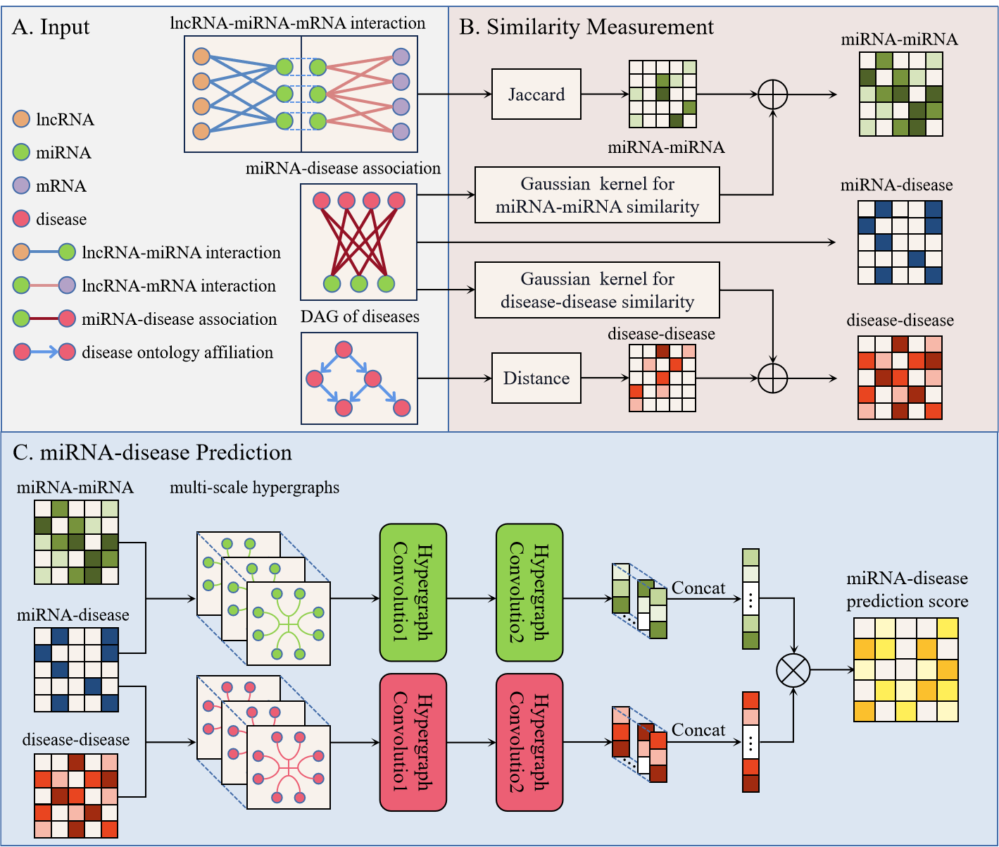

# MUS-HGFC: Predicting miRNA-Disease Associations via Multi-Scale Hypergraph Feature Integration
Code for our paper "Predicting miRNA-Disease Associations via Multi-Scale Hypergraph Feature Integration"

## Framework


## Data

Files of data are listed as follow:

- `d-d.txt`  is a matrix  `Sd`  that includes the similarity of all diseases, `Sd[i,j]`  denotes the similarity between disease `i`  and disease `j` .
- `m-d.txt` is a matrix  `Y`  that shows miRNA-disease associations. `Y[i,j]=1`  if miRNA `i`  and disease `j` are known to be associated, otherwise 0.
- `m-m.txt`  is a matrix  `Sm`  that includes the similarity of all miRNAs, `Sm[i,j]`  denotes the similarity between miRNA `i`  and miRNA `j` ..

## Options

We adopt an argument parser by package  `argparse` in Python, and the options for running code are defined as follow:

```python
parser = argparse.ArgumentParser()
parser.add_argument('--no-cuda', action='store_true', default=False,
                    help='Disables CUDA training.')
parser.add_argument('--seed', type=int, default=1, help='Random seed.')
parser.add_argument('--epochs', type=int, default=300,
                    help='Number of epochs to train.')
parser.add_argument('--lr', type=float, default=0.01,
                    help='Learning rate.')
parser.add_argument('--weight_decay', type=float, default=1e-7,
                    help='Weight decay (L2 loss on parameters).')
parser.add_argument('--hidden', type=int, default=64,
                    help='Dimension of representations')
parser.add_argument('--alpha', type=float, default=0.5,
                    help='Weight between miRNA space and disease space')
parser.add_argument('--data', type=int, default=1, choices=[1,2],
                    help='Dataset')

args = parser.parse_args()
args.cuda = not args.no_cuda and torch.cuda.is_available()
```
